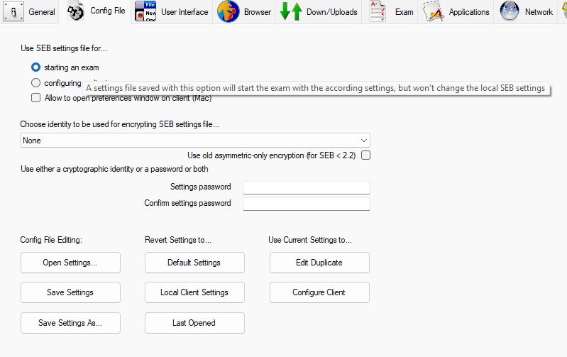
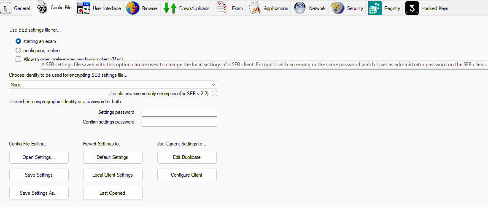
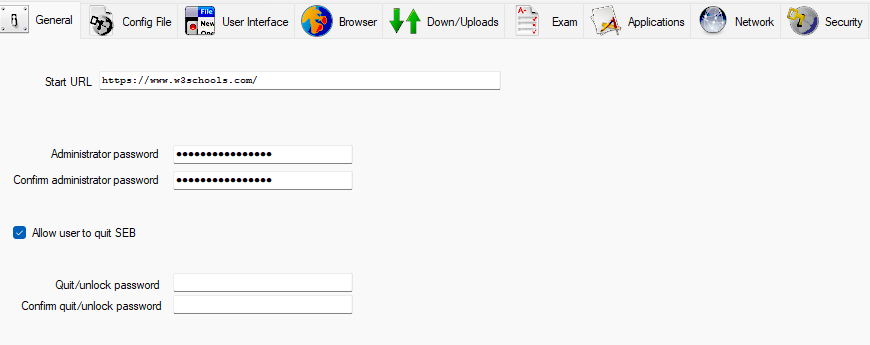
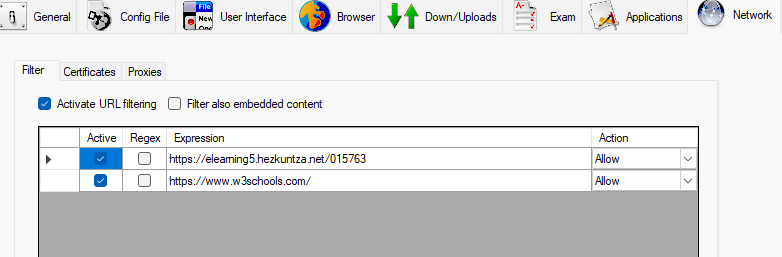
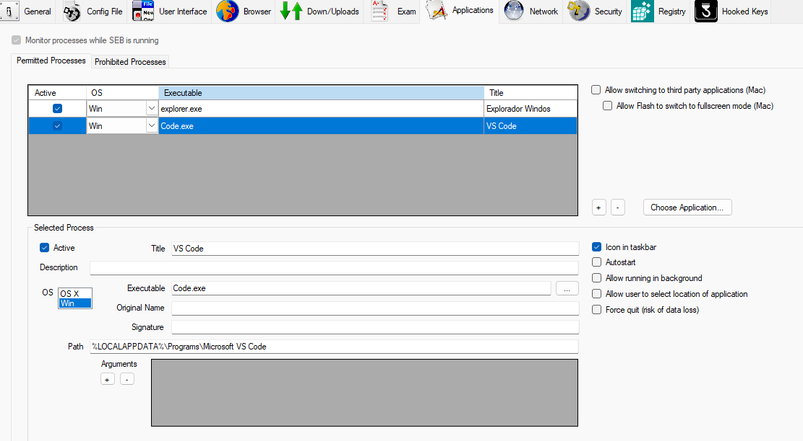
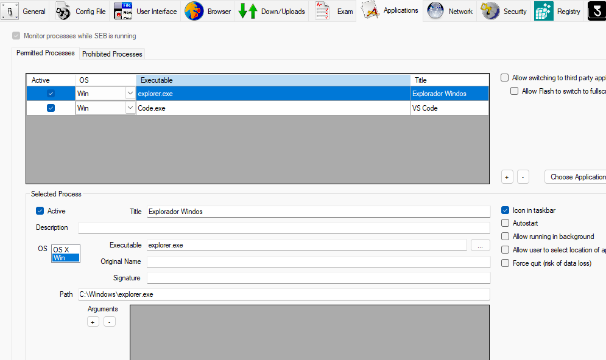

<a id="-cómo-usar-los-archivos-seb"></a>
# 📁 Archivos de configuración .seb

## ⚙️ Tipos de configuración

SEB ofrece dos tipos principales de configuraciones que puedes preparar desde el menú de configuración:

### 1. Configuración para Examen

Esta opción permite crear un archivo de configuración específico para un examen. Es ideal cuando necesitas configuraciones temporales que solo se aplicarán durante la duración de un examen.


*Figura 1: Menú de configuración para crear un archivo de examen*

### 2. Configuración para Cliente

Esta opción crea una configuración persistente que se aplicará al cliente SEB cada vez que se inicie. Es útil para configuraciones permanentes en equipos del aula.


*Figura 2: Menú de configuración para cliente SEB*

## 📋 Ejemplos de configuración

A continuación se presentan ejemplos prácticos de archivos de configuración .seb para diferentes escenarios de uso.

### 🔒 Ejemplo 1: Acceso restringido a URLs específicas

**Caso de uso**: Exámenes donde solo se permite el acceso al Moodle del instituto y a recursos educativos específicos.

**Características principales**:
- Solo permite el acceso a:
  - `https://elearning5.hezkuntza.net/015763` (Moodle del instituto)
  - `https://www.w3schools.com` (Recursos educativos)
- Bloquea todos los demás sitios web
- Navegación en modo pantalla completa
- Deshabilitación de funciones no deseadas

- **1. Configuración de contraseña**

La protección con contraseña evita que los estudiantes modifiquen la configuración de SEB. Para configurarla:

- Clave: `12345678`
- Se configura en el apartado "General" de la configuración de SEB


*Figura 1: Configuración de la contraseña en el apartado General de SEB*

**2. Configuración de URLs permitidas**

Para restringir el acceso únicamente a las páginas web deseadas:

1. Ve a la pestaña "Network"
2. Habilita la opción "Enable URL Filtering"
3. Configura las reglas para permitir solo:
   - `https://elearning5.hezkuntza.net/015763*`
   - `https://www.w3schools.com/*`


*Figura 2: Configuración de URLs permitidas en la pestaña Network*

### 🔒 Ejemplo 2: Aplicaciones permitidas

**Caso de uso**: Exámenes donde los estudiantes necesitan acceder a herramientas de desarrollo específicas junto con recursos en línea.

**Características principales**:
- Permite el acceso a las mismas URLs del ejemplo anterior
- Habilita dos aplicaciones adicionales:
  - Explorador de Windows (para gestión de archivos)
  - Visual Studio Code (para desarrollo)

**Configuración de aplicaciones**:

1. Ve a la pestaña "Applications"
2. Habilita "Allow applications"
3. Añade las aplicaciones permitidas:
   - `explorer.exe` (Explorador de Windows)
   - `code.exe` (Visual Studio Code)


*Figura 3: Habilitando Visual Studio Code en las aplicaciones permitidas*


*Figura 4: Habilitando el Explorador de Windows en las aplicaciones permitidas*

**Cómo usarlo":

1. [Descargar archivo de configuración .seb](https://drive.google.com/file/d/13cdAcXQvs8_Z57c36eWad536QGMj7v01/view?usp=sharing)
2. Sigue las instrucciones de [cómo usar los archivos .seb](#-cómo-usar-los-archivos-seb)


## 📝 Cómo usar los archivos .seb

1. **Descarga** el archivo de configuración deseado, y al abrirlo se ejecutará en SEB
2. **En Moodle**:
    - Ve al cuestionario donde quieras aplicar la configuración
    - En la configuración del cuestionario, busca la sección "Safe Exam Browser"
    - Selecciona "Usar archivo de configuración existente"
    - Sube el archivo .seb descargado
    - Guarda los cambios

## 🔧 Personalización de configuraciones

Los archivos .seb son archivos JSON que puedes editar con cualquier editor de texto. Estructura básica:

```json
{
  "sebExamConfig": {
    "startURL": "https://tumoodle.com",
    "browserViewMode": 1,
    "allowQuit": false,
    "quitURL": "about:blank",
    "allowReloadExam": false,
    "enableAudioControls": true
  }
}
```

### Parámetros comunes:
- `startURL`: URL que se abrirá al iniciar SEB
- `browserViewMode`: 0 = ventana normal, 1 = pantalla completa
- `allowQuit`: Permite salir de SEB (true/false)
- `quitURL`: URL a la que redirigir al salir
- `allowReloadExam`: Permite recargar el examen (true/false)
- `enableAudioControls`: Habilita controles de audio (true/false)

## ⚠️ Recomendaciones de seguridad

1. **Verificación previa**:
   - Siempre prueba las configuraciones en un entorno de prueba
   - Verifica que todas las restricciones funcionen como se espera

2. **Personalización**:
   - Ajusta las URLs según tu instalación de Moodle
   - Revisa y modifica las restricciones según tus necesidades específicas

3. **Mantenimiento**:
   - Mantén copias de seguridad de tus configuraciones
   - Actualiza las configuraciones cuando actualices la versión de SEB

## 🔄 Actualización de configuraciones

Si necesitas migrar configuraciones a una nueva versión de SEB:

1. Abre el archivo .seb en un editor de texto
2. Actualiza la versión del esquema si es necesario
3. Verifica la compatibilidad con la versión de SEB instalada
4. Prueba exhaustivamente antes de usar en producción
