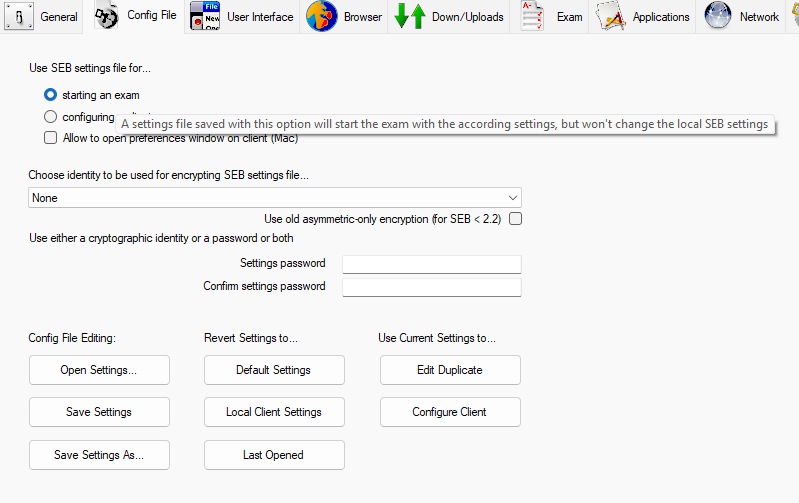
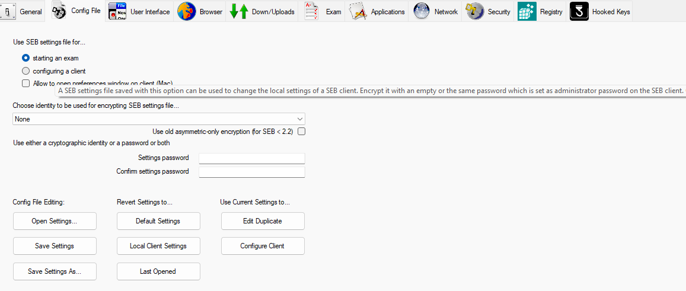
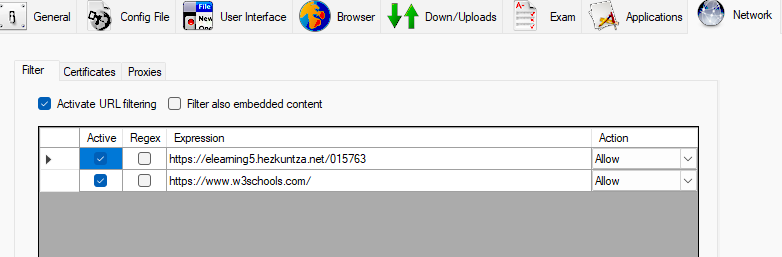
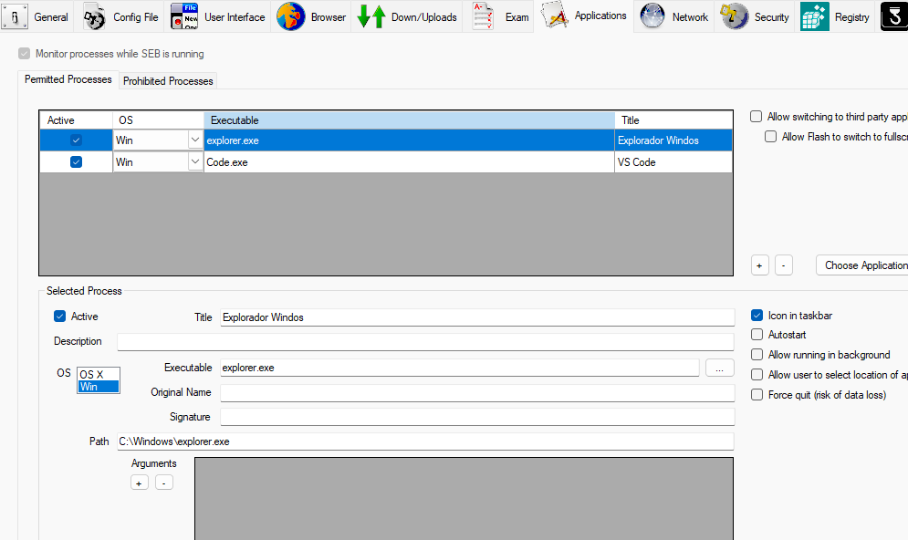

# SEB konfigurazio fitxategiak

## ⚙️ Konfigurazio motak

SEB-ek bi konfigurazio mota nagusi eskaintzen ditu, konfigurazio menutik prestatzen direnak:

### 1. Azterketarako konfigurazioa

Aukera honek azterketa baterako konfigurazio-fitxategi zehatza sortzeko aukera ematen du. Behin behineko konfigurazioak behar dituzunean erabilgarria da, azterketaren iraupenera mugatuta daudenak.

*1. irudia: Azterketa-fitxategia sortzeko konfigurazio menua*

### 2. Bezerorako konfigurazioa

Aukera honek konfigurazio iraunkorra sortzen du, SEB bezeroari aplikatuko zaiona martxan jarri bakoitzean. Ikasgelako ordenagailuetan konfigurazio iraunkorrak ezartzeko erabilgarria.

*2. irudia: SEB bezerorako konfigurazio menua*

## 🔒 Konfigurazio aurreratua: Moodle-rako SEB konfigurazioa

**Erabilera-kasua**: Ikasleek Moodle-n bakarrik eta baimendutako baliabideetan sartzeko aukera izan dezaten azterketetan.

**Ezaugarri nagusiak**:
- Baimendutako helbideak:
  - `https://elearning5.hezkuntza.net/015763` (Ikastetxeko Moodle-a)
  - `https://www.w3schools.com` (Hezkuntza-baliabideak)
- Beste webgune guztiak blokeatuta
- Pantaila osoko nabigazio-modua
- Ezarpenak aldatzea eragozten duen pasahitza
- Erabiltzaile-interfazea pertsonalizatua

### 1. Pasahitzaren konfigurazioa

Pasahitzak ikasleek SEB-ren konfigurazioa aldatzea eragozten du. Konfiguratzeko:

- Pasahitza: `12345678`
- "General" atalean konfiguratzen da SEB-en

*1. irudia: Pasahitzaren konfigurazioa SEB-en "General" atalean*

### 2. Baimendutako URL-ak

Nabigazioa baimendutako orrialdeetara mugatzeko:

1. Joan "Network" fitxara
2. Gaitu "Enable URL Filtering" aukera
3. Ezarri arauak honako helbideak baimetzeko:
   - `https://elearning5.hezkuntza.net/015763*`
   - `https://www.w3schools.com/*`

*2. irudia: Baimendutako URL-ak "Network" fitxan*

### 🔒 2. Adibidea: Baimendutako aplikazioak

**Erabilera-kasua**: Ikasleek garapen-tresna jakin batzuk erabili behar dituztenean, lineako baliabideekin batera.

**Ezaugarri nagusiak**:
- Aurreko adibideko URL berberak baimenduta
- Bi aplikazio gehiago gaituta:
  - Windows Explorer (fitxategi-kudeaketarako)
  - Visual Studio Code (garapenerako)

**Aplikazioen konfigurazioa**:
1. Joan "Applications" fitxara
2. Gaitu "Allow applications" aukera
3. Gehitu baimendutako aplikazioak:
   - `explorer.exe` (Windows Exploratzailea)
   - `code.exe` (Visual Studio Code)

*3. irudia: Visual Studio Code aplikazio gisa gaituz*

*4. irudia: Windows Exploratzailea aplikazio gisa gaituz*

### Nola erabili

1. [Deskargatu .seb konfigurazio-fitxategia](https://drive.google.com/file/d/13cdAcXQvs8_Z57c36eWad536QGMj7v01/view?usp=sharing)
2. Jarraitu [.seb fitxategiak erabiltzeko argibideak](#-nola-erabili-seb-fitxategiak)

## ℹ️ Nola erabili SEB fitxategiak

1. **Deskargatu** beharrezko konfigurazio-fitxategia (.seb) gure biltegitik
2. **Exekutatu** fitxategia SEB instalatuta duzun ordenagailuan
3. **Berretsi** segurtasun-mezua
4. **Hasi saioa** Moodle-n zure erabiltzailearekin
5. **Egiaztatu** nabigatzailearen goiburuan SEB ikurra agertzen dela

## ❓ Maiz egiten diren galderak

**Galdera**: Zergatik ezin dut baimendutako orrialdeetara sartu?
**Erantzuna**: Egiaztatu Internet konexioa eta URL-ak ondo idatzi direla. Baimendutako domeinuak zehazki bat etorri behar dute.

**Galdera**: Nola berrabiarazi dezaket nabigatzailea modu arruntean?
**Erantzuna**: SEB modu seguruan amaitzeko, sartu pasahitza eta sakatu "Quit SEB".

## 📞 Laguntza

Arazoren bat baduzu, jarri harremanetan zure sistemako administratzailearekin edo bidali mezu bat [laguntza@ikasle.eus](mailto:laguntza@ikasle.eus) helbidera.
