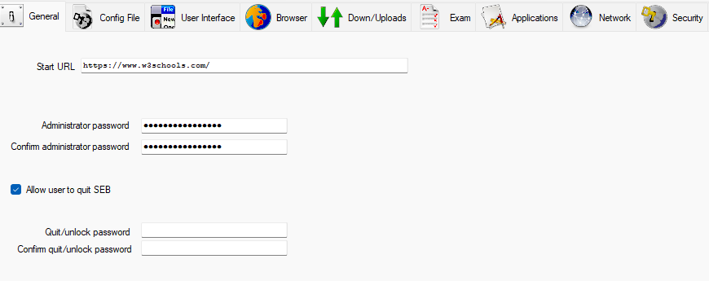

# SEB konfigurazio fitxategiak

## 🔒 Konfigurazio aurreratua: Moodle-rako SEB konfigurazioa

**Erabilera-kasua**: Ikasleek Moodle-n bakarrik eta baimendutako baliabideetan sartzeko aukera izan dezaten azterketetan.

**Ezaugarri nagusiak**:
- Baimendutako helbideak:
  - `https://elearning5.hezkuntza.net/015763` (Ikastetxeko Moodle-a)
  - `https://www.w3schools.com` (Hezkuntza-baliabideak)
- Beste webgune guztiak blokeatuta
- Pantaila osoko nabigazio-modua
- Ezarpenak aldatzea eragozten duen pasahitza
- Erabiltzaile-interfazea pertsonalizatua

### 1. Pasahitzaren konfigurazioa

Pasahitzak ikasleek SEB-ren konfigurazioa aldatzea eragozten du. Konfiguratzeko:

- Pasahitza: `12345678`
- "General" atalean konfiguratzen da SEB-en

*1. irudia: Pasahitzaren konfigurazioa SEB-en "General" atalean*

### 2. Baimendutako URL-ak

Nabigazioa baimendutako orrialdeetara mugatzeko:

1. Joan "Network" fitxara
2. Gaitu "Enable URL Filtering" aukera
3. Ezarri arauak honako helbideak baimetzeko:
   - `https://elearning5.hezkuntza.net/015763*`
   - `https://www.w3schools.com/*`

*2. irudia: Baimendutako URL-ak "Network" fitxan*

### Nola erabili

1. [Deskargatu .seb konfigurazio-fitxategia](https://drive.google.com/file/d/13cdAcXQvs8_Z57c36eWad536QGMj7v01/view?usp=sharing)
2. Jarraitu [.seb fitxategiak erabiltzeko argibideak](#-nola-erabili-seb-fitxategiak)

## 📥 Eskuragarri dauden konfigurazioak

### 1. Oinarrizko konfigurazioa
- **Erabilera**: Murriztapen arruntak dituzten azterketetarako
- **Ezaugarri nagusiak**:
  - Nabigatzailetik irtetea blokeatuta
  - Teklatu-lasterbideak desgaituta
  - Pantaila-azalpena desgaituta

### 2. Konfigurazio aurreratua
- **Erabilera**: Segurtasun-neurri zorrotzak behar dituzten azterketetarako
- **Ekarpen gehigarriak**:
  - Web-kamera bidezko monitorizazioa
  - Aplikazioen blokeo aurreratua
  - Jarduera-erregistro zehatza

## ℹ️ Nola erabili SEB fitxategiak

1. **Deskargatu** beharrezko konfigurazio-fitxategia (.seb) gure biltegitik
2. **Exekutatu** fitxategia SEB instalatuta duzun ordenagailuan
3. **Berretsi** segurtasun-mezua
4. **Hasi saioa** Moodle-n zure erabiltzailearekin
5. **Egiaztatu** nabigatzailearen goiburuan SEB ikurra agertzen dela

## ❓ Maiz egiten diren galderak

**Galdera**: Zergatik ezin dut baimendutako orrialdeetara sartu?
**Erantzuna**: Egiaztatu Internet konexioa eta URL-ak ondo idatzi direla. Baimendutako domeinuak zehazki bat etorri behar dute.

**Galdera**: Nola berrabiarazi dezaket nabigatzailea modu arruntean?
**Erantzuna**: SEB modu seguruan amaitzeko, sartu pasahitza eta sakatu "Quit SEB".

## 📞 Laguntza

Arazoren bat baduzu, jarri harremanetan zure sistemako administratzailearekin edo bidali mezu bat [laguntza@ikasle.eus](mailto:laguntza@ikasle.eus) helbidera.
